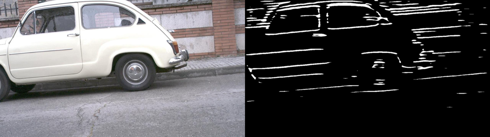
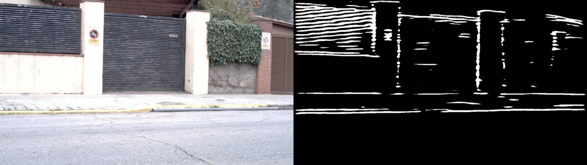

# 🚗 U-Net Edge Detection

PyTorch project that predicts razor-sharp object boundaries on street-scene images.  
A custom-trained **U-Net (ResNet-34 encoder)** does the heavy lifting; its logits are fused with Sobel + Canny maps for cleaner, unbroken edges.

<div align="center">

| Original → Prediction |
|-----------------------|
|  |
|  |
|  |

<sub><sup>More results in <code>examples/</code> (10 curated side-by-side images)</sup></sub>

</div>

---

## ✨ Highlights

| What I built | Where to look |
|--------------|--------------|
| **End-to-end DL pipeline** | `train.py` – U-Net fine-tuning, BCE + Dice loss, on-the-fly Gaussian blur, per-epoch checkpoints |
| **Hybrid CV + DL logic** | `predict.py` – logits thresholded, resized to original res, OR-fused with Sobel/Canny for extra crispness |
| **Clean engineering** | Modular `src/` (typed, doc-stringed), minimal pinned `requirements.txt`, tidy repo tree |
| **Reproducibility** | Deterministic seeds, version-pinned deps, one-command demo |

---

## 🚀 Quick start (inference)

```bash
# 1 – (optional) create & activate a clean env
python -m venv .venv && source .venv/bin/activate    # Windows: .venv\Scripts\activate

# 2 – install dependencies
pip install -r requirements.txt

# 3 – run inference
#    • edit the two paths at the bottom of predict.py
#    • then simply:
python predict.py
# outputs are written to output/edges/ and results/
```
## 🏋️‍♂️ Training from scratch
```bash
# 1-liner: grab BIPED (~230 MB) via Kaggle CLI
kaggle datasets download -d xavysp/biped -p data --unzip
# ⤷  extracts to data/BIPED/…

# adjust the two paths at the bottom of train.py if needed, then:
python train.py
```
train.py expects: 
``` 
data/BIPED/imgs/train/rgbr/real # RGB training images
data/BIPED/edge_maps/train/rgbr/real # Matching edge masks
```

Checkpoints drop into models/ after every epoch.

## 🗂 Repo layout 

```bash
src/            dataset.py, model.py (U-Net factory)
train.py        fine-tunes U-Net on BIPED masks
predict.py      generates edge maps + comparison collages
examples/       10 cherry-picked results for the README
requirements.txt
.gitignore
LICENSE         MIT
README.md
```
